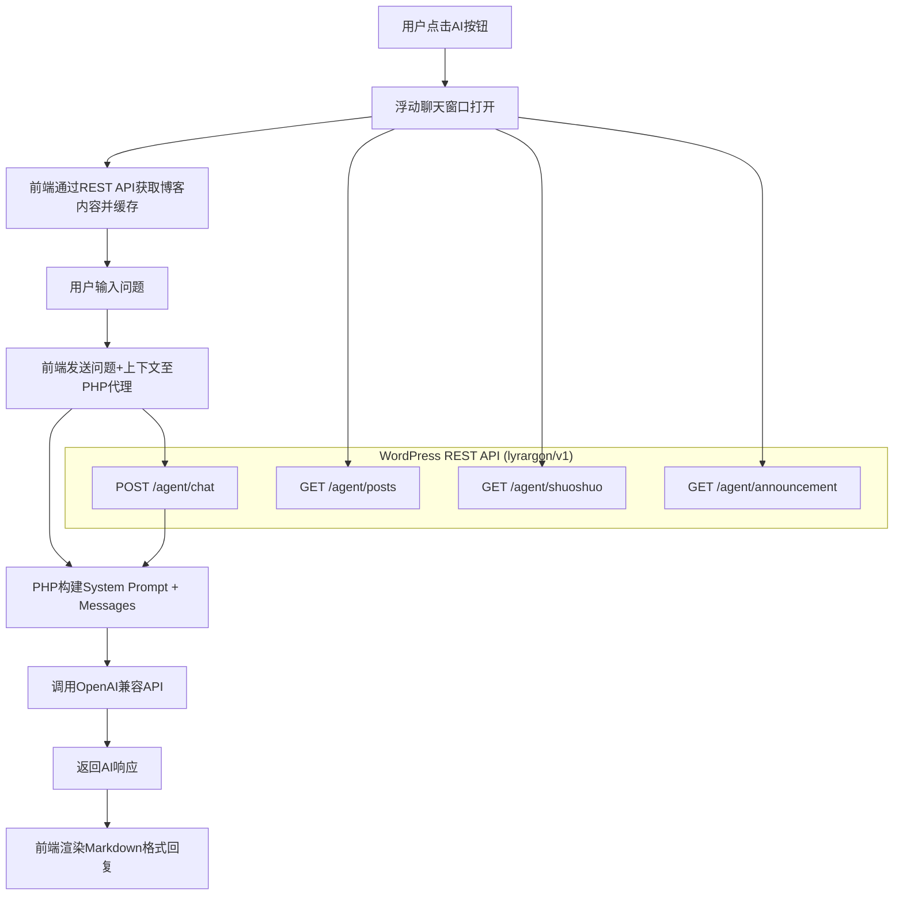

## 产品概述
在 Lyrargon WordPress 主题的浮动按钮组中，新增一个 AI Agent（AI 助手）功能。在夜间模式按钮下方添加一个 AI 按钮，点击后弹出浮动在屏幕左下角的聊天窗口。AI 助手通过 REST API 读取博客文章、侧边栏公告和说说内容作为知识库，并接入 OpenAI 兼容 API（如 DeepSeek）进行智能问答。

## 核心功能
1. 在现有浮动按钮组（夜间模式按钮下方）新增 AI Agent 按钮
2. 点击按钮后，屏幕左下角弹出浮动聊天窗口（非新标签页）
3. AI 助手通过 WordPress REST API 获取博客文章、侧边栏公告和说说内容作为上下文知识库
4. 接入 OpenAI 兼容 API（如 DeepSeek），支持自然语言问答
5. 聊天窗口支持消息发送/接收、加载状态、关闭/最小化
6. 主题设置页新增 AI API 配置（API 地址、Key、模型名称等）
7. 兼容现有夜间模式/暗黑模式


## 技术栈
- **后端**: WordPress PHP（主题现有架构） + REST API
- **前端**: JavaScript (jQuery) + CSS（沿用主题现有技术栈）
- **AI API**: OpenAI 兼容接口（通过 PHP 代理转发，避免暴露 API Key）

## 实现方案

### 架构概览
采用 PHP 代理模式：前端将用户问题和博客上下文发送到 WordPress REST API 端点，PHP 端负责调用 OpenAI 兼容 API 并返回结果。API Key 存储在 WordPress 选项中，不暴露给前端。

### 数据流
```
用户输入问题 → 前端收集上下文(文章/说说/公告) → POST /lyrargon/v1/agent/chat →
PHP 构建 prompt + 调用 AI API → 返回响应 → 前端渲染 Markdown 回复
```

### 系统架构



### 模块划分

#### 1. PHP 后端 (inc/agent.php)
在 `lyrargon/v1` 命名空间下注册 4 个 REST 端点：

| 方法 | 路由 | 功能 | 输入参数 | 返回数据 |
|------|------|------|---------|---------|
| GET | `/lyrargon/v1/agent/posts` | 获取最近文章 | `per_page` (默认20) | id, title, excerpt, url, date |
| GET | `/lyrargon/v1/agent/shuoshuo` | 获取最近说说 | `per_page` (默认20) | id, content, date, upvotes |
| GET | `/lyrargon/v1/agent/announcement` | 获取公告 | 无 | content (侧边栏公告文本) |
| POST | `/lyrargon/v1/agent/chat` | 代理调用 AI | messages[], system_prompt | AI 回复内容 |

`/agent/chat` 端点的核心逻辑：
- 接收前端发送的 messages 数组 + 可选的 system_prompt
- 从 WordPress 选项中读取 API 配置（endpoint, key, model）
- 使用 `wp_remote_post()` 调用 OpenAI 兼容 API
- 返回 AI 回复内容

#### 2. 前端 JavaScript (新建 assets/js/ai-agent.js)
- AI 按钮点击事件：切换浮动窗口显示/隐藏
- 窗口初始化时通过 REST API 获取并缓存博客内容
- 聊天界面交互：发送消息、显示回复、加载动画
- 构建包含博客上下文的 System Prompt
- Markdown 渲染（使用轻量级方案或简单正则）
- 消息历史管理（保留最近 N 轮对话）
- 窗口拖拽功能

#### 3. CSS 样式 (style.css)
- 浮动窗口样式（左下角固定定位，卡片毛玻璃效果）
- 消息气泡样式（用户/AI 区分）
- 输入框和发送按钮样式
- 加载动画（打字指示器）
- 暗色模式适配（`html.darkmode` 选择器）

#### 4. 主题设置 (settings.php)
在 Lyrargon 设置页面新增 "AI 助手" 配置选项卡，包含：
- API 端点地址（默认 https://api.deepseek.com/v1/chat/completions）
- API Key（密码输入框）
- 模型名称（默认 deepseek-chat）
- System Prompt 模板（默认基于博客上下文的提示词）
- 温度 (temperature) 滑块
- 最大 Token 数

### 关键技术决策

1. **PHP 代理而非前端直接调用**：保护 API Key 安全，避免 CORS 问题，可利用 WP HTTP API 的重试/超时机制
2. **前端缓存博客上下文**：打开窗口时一次性获取内容，缓存在 JS 变量中，避免每次提问都重复请求
3. **System Prompt 动态构建**：将文章/说说/公告内容格式化为 AI 可理解的上下文，引导 AI 基于博客知识回答
4. **采用独立 JS 文件**而非嵌入 argontheme.js：逻辑独立，便于维护，按需加载
5. **拖拽支持**：通过 jQuery 实现窗口拖拽，提升用户体验

### 性能考虑
- 文章/说说获取限制数量（默认 20 篇），避免 prompt 过长导致 token 消耗过大
- API 调用设置 30 秒超时
- 浮动窗口使用 CSS `will-change: transform` 优化渲染
- 消息列表使用 `overflow-y: auto` 虚拟滚动概念，避免渲染过多 DOM

### 夜间模式兼容
- 浮动窗口使用 CSS 变量实现暗色模式适配（`html.darkmode` 选择器）
- 复用主题现有的 `--color-foreground`、`--color-background` 等 CSS 变量
- 按钮图标随暗色模式变化

## 文件修改清单

```
lyrargon/
├── inc/
│   └── agent.php                  # [NEW] AI Agent REST API 端点 + AI API 代理
├── header.php                     # [MODIFY] 在 #float_action_buttons 中添加AI按钮 + 浮动窗口HTML模板
├── style.css                      # [MODIFY] 添加浮动窗口、消息气泡、输入框等CSS样式
├── assets/js/
│   └── ai-agent.js                # [NEW] AI Agent 前端交互逻辑
├── inc/core.php                   # [MODIFY] 注册 ai-agent.js 和 ai-agent.css 资源（wp_enqueue_scripts）
├── settings.php                   # [MODIFY] 新增 "AI 助手" 设置选项卡
└── functions.php                  # [MODIFY] 在模块加载白名单中排除 agent.php（可选，当前autoload默认包含所有）
```


## Agent Extensions

### SubAgent
- **code-explorer**
  - 用途：在实施阶段用于快速定位文件中的特定位置（如 header.php 中按钮组的确切行号、style.css 中浮动按钮样式的起止行），确保修改精准
  - 预期产出：精确的文件行号和代码片段上下文

### Skill
- 本次暂无需使用技能
